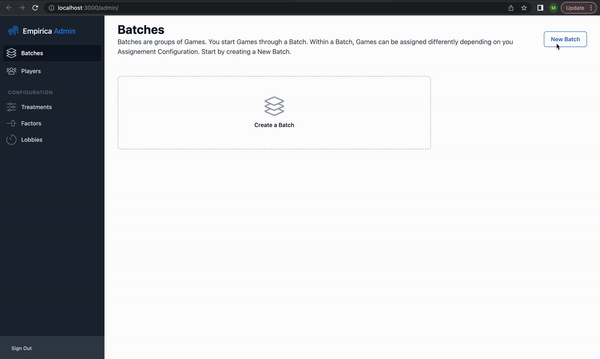
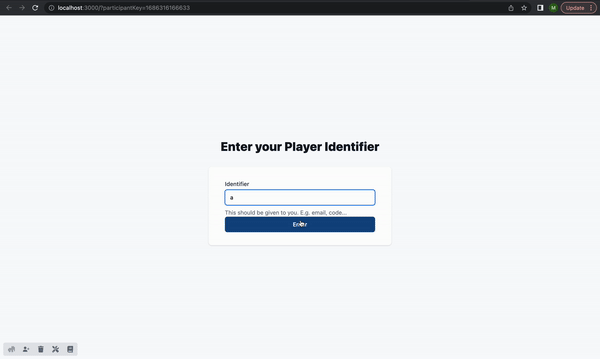

# Part 2: Creating the Experiment in Empirica

To create your experiment, open your terminal and navigate to the directory where you want to create your project. (e.g. `cd ~/Desktop`). You can find a refresher on terminal commands used to navigate directories here:


[helpful-linux-commands.md](../../resources/helpful-linux-commands.md)


### Set up a project using the template experiment

To set up a template experiment, enter the following command in your terminal window:

```sh
empirica create prisoners-dilemma
```

This will create a folder named 'prisoners-dilemma' for the project and populate it with a template experiment. (e.g. `~/Desktop/prisoners-dilemma`)&#x20;

You should see something similar to the following:


```bash
    ✓  Setup directory
    ✓  Copy project files
    ✓  Install client packages
    ✓  Install server packages
    ✓  Upgrade empirica packages
    ✓  Generate default settings
                                                                                                                          
    Empirica (local build) experiment created.                                                                                   
    Get started:                                                   
                                                                  
        > cd prisoners-dilemma                                        
        > empirica   
```


To work within the newly created folder, change into the newly created directory:

```sh
cd prisoners-dilemma
```

### Test-drive the template experiment

To start the experiment, run the command:

```sh
empirica
```

You should see something similar to the following in the terminal window:                                               &#x20;


```bash
    Empirica (local build) server running:                                       
                                                                                
        Player  http://localhost:3000                                             
        Admin   http://localhost:3000/admin  
```


To view the experiment, type `http://localhost:3000/admin/` into your browser address bar. (You can use any browser you like, the images in this tutorial show the Chrome browser.) You will see the Empirica admin interface, which handles setting up treatments and launching batches of games:

<figure><figcaption></figcaption></figure>

> Note: if you see a login page like the following, you should use the username "admin".&#x20;
>
> You can print the auto-generated password by running the terminal command `cat .empirica/empirica.toml` within your `prisoners-dilemma` folder.&#x20;

<figure><figcaption><p>Admin console login screen</p></figcaption></figure>

#### Start a "batch"

The admin console opens to the "Batches" tab. To create a new batch, click the "New Batch" button to open the batch creation drawer. We will create one game with the "Two Players" treatment. Edit your settings to look like this:

<figure><figcaption></figcaption></figure>

Click `Create` to return to the main batch screen. You'll see that a batch has been added to the batches list. Click "Start" to begin the batch.&#x20;

<figure><figcaption></figcaption></figure>

If you find it helpful to see the process animated:

<figure><figcaption><p>admin site example</p></figcaption></figure>

#### Play the game

To play the game, open a new tab to url `http://localhost:3000/`. You should see something like the following:

<figure><figcaption></figcaption></figure>

For now, enter your name as the identifier. When your experiment is deployed, this will be where participants enter their MTurk Worker ID, Prolific Identifier, etc.

You will need to create a second player to join the game. While you are developing the game on your local computer, you will see a toolbar in the lower left corner:&#x20;

<figure><figcaption></figcaption></figure>

Click the second button to add a new participant - a view for this second participant will open in a new tab. Enter a **different** identifier, and walk through the experiment by playing for both participants. **Try opening each of the players' tabs side-by-side so you can see how each player's view is updated in real time!**&#x20;

<figure><figcaption></figcaption></figure>

**As a brief rundown, the stages of the experiment are as follows:**

1. Player Consent
2. Player Identification
3. Intro Steps (Here an "Instructions" page)&#x20;
4. A lobby, where you wait for enough players to complete the introduction for the game to launch
5. Synchronous Game Stages (here a guessing game, and minesweeper, just for fun)
6. Exit Steps (surveys, payment instructions, debrief, etc)

#### Stop the development server

Once you have had a chance to play through the game, return to your terminal window and shut down the empirica server by pressing the control key and the 'c' key simultaneously (`<ctrl>+c`). If it asks you for confirmation, you can push the same key combination again.
