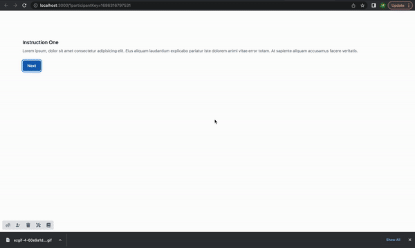

# Part 4.2: Intro Text

The first step in coding our experiment will be to replace the filler text in the Introduction page with actual instructions for the participant. This text is stored the file `client/src/intro-exit/Introduction.jsx`. The component will initially look like this:


```jsx
import React from "react";
import { Button } from "../components/Button";

export function Introduction({ next }) {
  return (
    <div className="mt-3 sm:mt-5 p-20">
      <h3 className="text-lg leading-6 font-medium text-gray-900">
        Instruction One
      </h3>
      <div className="mt-2 mb-6">
        <p className="text-sm text-gray-500">
          Lorem ipsum, dolor sit amet consectetur adipisicing elit. Eius aliquam
          laudantium explicabo pariatur iste dolorem animi vitae error totam. At
          sapiente aliquam accusamus facere veritatis.
        </p>
      </div>
      <Button handleClick={next} autoFocus>
        <p>Next</p>
      </Button>
    </div>
  );
}

```


The function contained in this file is called a **React Component**. This is just a function that returns a piece of a page for your browser to display, and it can contain other React components within it. By assembling a number of different React components in a hierarchy, we can build up the whole page, while being able to separate reusable pieces into their own files.&#x20;

For example, the `Button` element is another React component that we import into this file. The button's behavior and styling are defined in a separate file (`src/components/Button.jsx`) so that we can reuse it in a number of pages in our experiment.

All components need to return something that React will translate into plain HTML to display on the page. In this case, it is returning mostly HTML, with the `Button` component and a little inline styling thrown in (more on this later).

For now, lets replace just the display text (and it's paragraph tags `<p>...</p>`, lines 11-15 above) with instructions related to the prisoners dilemma.&#x20;

Feel free to experiment with your own text and styling. The code below is what we will use in this tutorial:

```html
      <p>
        In this game, you will be partnered with another experiment participant.
        <br />
        In <strong>each round of the game</strong>, you and your partner will:
      </p>
      <p>
        (a) choose whether to work together or to look out for your own
        interests
      </p>
      <p>
        (b) see each others choices and the results of your choices
      </p>
```

Within the browser, you can see these changes reflected immediately by simply saving the changed file. (In some cases, you may need to refresh the page.) This is called 'hot reloading', which is incredibly useful for debugging and UI editing.

<figure><figcaption><p>hot reloading</p></figcaption></figure>

Your edited file should look like this:

<pre class="language-jsx" data-title="Introduction.jsx" data-line-numbers><code class="lang-jsx"><strong>import React from "react";
</strong>import { Button } from "../components/Button";

export function Introduction({ next }) {
  return (
    &#x3C;div className="mt-3 sm:mt-5 p-20">
      &#x3C;h3 className="text-lg leading-6 font-medium text-gray-900">
        Instruction One
      &#x3C;/h3>
      &#x3C;div className="mt-2 mb-6">
        &#x3C;p>
          In this game, you will be partnered with another experiment
          participant.
          &#x3C;br />
          In &#x3C;strong>each round of the game&#x3C;/strong>, you and your partner will:
        &#x3C;/p>
        &#x3C;p>
          (a) choose whether to work together or to look out for your own
          interests
        &#x3C;/p>
        &#x3C;p>(b) see each others choices and the results of your choices&#x3C;/p>
      &#x3C;/div>
      &#x3C;Button handleClick={next} autoFocus>
        &#x3C;p>Next&#x3C;/p>
      &#x3C;/Button>
    &#x3C;/div>
  );
}
</code></pre>
