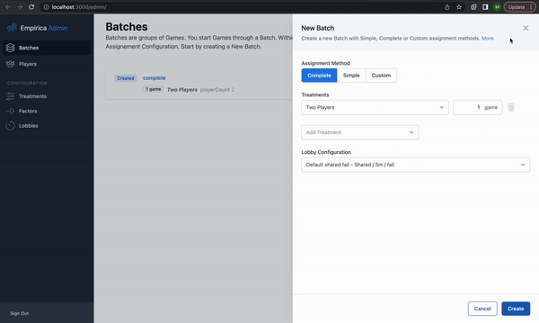

# Part 4.3: Set up the game stages

Now we will create placeholders for the two stages that the participants will use to play the game. First, in the **'Choice'** stage, participants will decide whether to cooperate, or defect. Second, in the **'Result'** stage, they will see the choice that their partner made, and their payoff.

#### Create placeholder components

Create a folder in the `client/src`. We will call it `stages`, as it will hold the code for the various stages the participant will progress through.

Within this folder, we will create 2 files. First, create `Choice.jsx` with the following placeholder code:


```jsx
import React from "react";

export function Choice() {
  return <div>"Choice" component not yet implemented</div>;
}
```


Second, create `Result.jsx` with the following boilerplate code:


```jsx
import React from "react";

export function Result() {
  return <div>"Result" component not yet implemented</div>;
}
```


#### Set up stage sequencing

Now we need to tell Empirica that within each round of the game, participants will advance through two sequential stages: one called "**Choice"** and one called **"Result".**&#x20;

We do this on the server, so that Empirica can coordinate advancing all players through the stages simultaneously. The place for this is in the `onGameStart` callback, found in `server/src/callbacks.js`. This function is called when enough players have advanced to the lobby for the game to start, and it is where we can most easily modify the sequence of the game.

First we need to add a 'round' to the game, using the `game.addRound` function. This function takes a dictionary with various keys, for now we'll just use the `name` key. &#x20;

```javascript
Empirica.onGameStart(({ game }) => {
  const round = game.addRound({
    name: `Round`,
   });
});
```

After we have created the round, we need to attach a stage to it for each of the choice and result stages:

```javascript
Empirica.onGameStart(({ game }) => {
  const round = game.addRound({
    name: `Round`,
   });
   round.addStage({name: "choice", duration:10000});
   round.addStage({name: "result", duration:10000});
});
   
```

For now, we'll set the maximum duration of each stage to 10,000 seconds, after which the game will advance even if one or more players has not submitted an answer. This is to make it easier to develop the experiment. When we are getting ready to deploy our experiment, we will set this to a more reasonable number.

The `server/src/callbacks.js` file should now look like this:


```javascript
import { ClassicListenersCollector } from "@empirica/core/admin/classic";
export const Empirica = new ClassicListenersCollector();

Empirica.onGameStart(({ game }) => {
  const round = game.addRound({
    name: `Round`,
  });
  round.addStage({ name: "choice", duration: 10000 });
  round.addStage({ name: "result", duration: 10000 });
});

Empirica.onRoundStart(({ round }) => {});

Empirica.onStageStart(({ stage }) => {});

Empirica.onStageEnded(({ stage }) => {});

Empirica.onRoundEnded(({ round }) => {});

Empirica.onGameEnded(({ game }) => {});
```


#### Display components during the appropriate stages

Now that we have placeholders for the components that will be displayed during the 'choice' and 'result' stages, and Empirica knows to coordinate these two stages, we need to tell the participant display to show the correct component during the correct time window.

For this, we will return to `client/src/Stage.jsx`, which by convention handles switching displays between different stages of the game. (This is just convention, you can use any structure of React components that works for your experiment.)

FIrst, we need to tell the `client/src/Stage.jsx` component which stage of the game we are currently in. We will use Empirica's `useStage` hook to gain access to the object representing the current stage in the game. ([Hooks](https://react.dev/reference/react) are React functions that return an object that can be shared across a number of different components.)

First we need to import this hook by adding it to the hooks already in our import list:

```jsx
import {
  usePlayer,
  usePlayers,
  useRound,
  useStage,
} from "@empirica/core/player/classic/react";
```

We then need to call the hook to gain access to the stage object. We put calls to all of the hooks at the top of the component, so the following line can go under the calls to the `useRound` hook:

```
const stage = useStage();
```

Now we can use the value of the stage object in a `switch` statement to display a different component for each value of the stage's name. This code will replace the code `return <p>Not yet implemented...</p>;` that we used as a placeholder earlier.

```jsx
switch (stage.get("name")) {
    case "choice":
      return <></>;
    case "result":
      return <></>;
    default:
      return <Loading />;
  }
```

For now, we're using a pair of empty tags in place of the objects.

Lastly, we need to import the placeholder components we defined above. Import statements such as these all belong together at the top of the file:

```jsx
import { Choice } from "./stages/Choice";
import { Result } from "./stages/Result";
```

Finally, we can use these components inside the switch statement instead of the empty tags `<></>`.

```jsx
  switch (stage.get("name")) {
    case "choice":
      return <Choice />;
    case "result":
      return <Result />;
    default:
      return <Loading />;
  }
```

With all changes made, the `Stage.jsx` file should look like this:


```jsx
import {
  usePlayer,
  usePlayers,
  useRound,
  useStage,
} from "@empirica/core/player/classic/react";
import { Loading } from "@empirica/core/player/react";
import React from "react";
import { Choice } from "./stages/Choice";
import { Result } from "./stages/Result";

export function Stage() {
  const player = usePlayer();
  const players = usePlayers();
  const round = useRound();
  const stage = useStage();

  if (player.stage.get("submit")) {
    if (players.length === 1) {
      return <Loading />;
    }

    return (
      <div className="text-center text-gray-400 pointer-events-none">
        Please wait for other player(s).
      </div>
    );
  }

  switch (stage.get("name")) {
    case "choice":
      return <Choice />;
    case "result":
      return <Result />;
    default:
      return <Loading />;
  }
}
```


> Note: Remember to restart your server using the command `rm .empirica/local/tajriba.json; empirica` in your terminal whenever you make an update to a server-side file.

Restart your server, and walk through your experiment. It should look like this:

<figure><figcaption><p>admin and participant sites at the end of this step</p></figcaption></figure>
