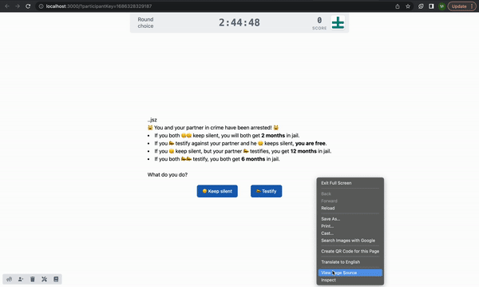
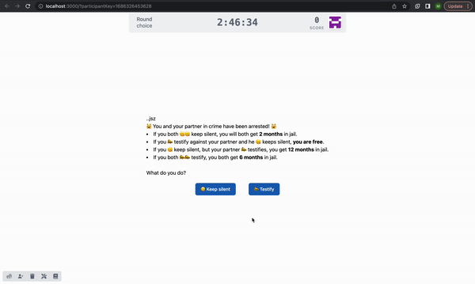

# Part 4.4: Build the "Choice" React Component

At this point, we'll get into a little bit more user interface design, by filling out the "Choice.jsx" placeholder we created earlier.&#x20;

#### Describe the Prisoner's Dilemma in Text

First, we'll enter some text to describe the Prisoner's Dilemma to the participant in more detail. In our `client/src/stages/Choice.jsx` file, we can replace the  "Choice component not yet implemented" text we had earlier with the following description, keeping the outer `<div> ... </div>` tags.&#x20;

> Note: we need to use parentheses to enclose the return statement when it spans more than one line.

```jsx
  return (
    <div>
      <h2>🙀 You and your partner in crime have been arrested! 🙀</h2>
      <ul className="list-disc list-inside">
        <li>
          If you both 🤐🤐 keep silent, you will both get
          <strong>2 months</strong> in jail.
        </li>
        <li>
          If you 📣 testify against your partner and he 🤐 keeps silent,
          <strong>you are free</strong>.
        </li>
        <li>
          If you 🤐 keep silent, but your partner 📣 testifies, you get 
          <strong>12 months</strong> in jail.
        </li>
        <li>
          If you both 📣📣 testify, you both get <strong>6 months</strong> in
          jail.
        </li>
      </ul>
      <br />
      <p>What do you do?</p>
    </div>
  );

```

In this description, we use standard HTML tags for an unordered list to format the text (for more information, see [here](https://www.w3schools.com/html/default.asp)). If you save the file at this point and return to your browser, you should be able to see the text we just entered formatted nicely.

#### Add buttons for each option

We also want to add a button for each choice. First we need to import the button component at the top of the file:

```jsx
import { Button } from "../components/Button";
```

Now we can create the button components themselves. These will sit below the text, but within the outermost `<div>` tag. We will enclose them in additional `<div></div>` tags so that we can apply some styling to them independently of the rest of the page

```jsx
      <div className="flex justify-center">
        <Button>🤐 Keep silent</Button>
        <Button>📣 Testify</Button>
      </div>
```

The `className` attribute here is a list of inline styling parameters, which follow the format of [Tailwind CSS](https://tailwindcss.com/). You don't need to know anything else about this now, other than to know that [`flex`](https://tailwindcss.com/docs/flex) allows components to adjust to the size of the window, and [`justify-center`](https://tailwindcss.com/docs/justify-content#center) centers the contents of the `<div>`. There are a wide variety of styling keywords you can use to structure your pages, and it is well worth reading through the Tailwind documentation.

In addition to styling the `<div>` we can also apply style to the buttons themselves. In this case, we'll add 5 pixels of margin around each button, to separate them from one another and the remaining content, as below:

```jsx
      <div className="flex justify-center">
        <Button className="m-5">🤐 Keep silent</Button>
        <Button className="m-5">📣 Testify</Button>
      </div>
```

#### Handle the button clicks

If you click the buttons at this point, nothing will happen, because we haven't "handled" the button click event. To do so, we need to create a new function that will be called when a button is clicked. This function will live inside the `Choice` component, prior to the `return` statement, and should take a single parameter that indicates which button was clicked. For now, all it will do is log the value of the parameter that was passed into it:

```javascript
  function onClick (choice) {
    console.log("You chose:", choice)
  };
```

Now we need to make sure this function gets called when the button is clicked. If you look at the file in which the Button component is defined, you'll notice that it has a `handleClick` argument that accepts a function to be called when the button is clicked. We can't pass our `onClick` function directly into this argument, however, because we need to specify the value of the `choice` that will be passed to `onClick`.&#x20;

We do this with an [arrow function](https://javascript.info/arrow-functions-basics). The function will take an empty argument list `()` and then call the `onClick` function for us, with the right value of the argument. For example:

```javascript
() => onClick("silent")
```

defines a function we can pass along to our button component that will then call our `onClick` function with the choice "silent". Our code for the button components now should look like this:

```jsx
<Button className="m-5" handleClick={() => onClick("silent")}>🤐 Keep silent</Button>
<Button className="m-5" handleClick={() => onClick("testify")}>📣 Testify</Button>
```

Now if you return to the browser, and click the buttons, you should see the name of the button output to the browser console.


Wait! What's the browser console?\
\
The browser console is your best friend for debugging. You can open the console in chrome by clicking the three vertical dots in the upper right corner, and navigating to "More tools > Developer Tools". (Or on a mac, pressing `<Command>+<Option>+j`.

This opens a whole suite of tools that are used by website developers to see what is going on behind the scenes of their webpage. The console log is one of the most helpful. You can have pages log the values of intermediate variables and view them here to check your work as you go along.


<figure><figcaption><p>Another way to get to console: right click > Inspect > Console; How to check console.log()</p></figcaption></figure>

#### Save the response

Now we need to save the value of the player's choice. We may want to have multiple rounds in the future, so we'll save it to the `player.round` object, which is unique to the player and to the round.&#x20;

First we need to import the `usePlayer` hook, which will give us access to the player object. This belongs with the other import statements at the top of the file:

```jsx
import { usePlayer } from "@empirica/core/player/classic/react";
```

Now we need to access the player object using the hook we just imported. Hooks need to be called first in a React component, so this statement should be the first line in the `Choice` function.&#x20;

```jsx
const player = usePlayer();
```

We want to save the value to the `player.round` object. Empirica provides a `.set("key", value)` function for this object (along with the `player` itself, the `round`, the `stage`, the `game`, etc). We can replace the `console.log(...)` statement in our `onClick` function with the following `set` statement:

```jsx
player.round.set("decision", choice);
```

#### Submit the stage

The last thing we need to do is tell Empirica when the player clicks one of the buttons that they are ready to move onto the next stage. We can do this immediately after we set the value to the `player.round` object, inside the `onClick` callback function. We just need to set a `submit` value on the player.stage object to true:

```
player.stage.set("submit", true);
```

Now the Choice component is complete. Your full code should look like the following:


```jsx
import React from "react";
import { Button } from "../components/Button";
import { usePlayer } from "@empirica/core/player/classic/react";

export function Choice() {
  const player = usePlayer();

  function onClick(choice) {
    player.round.set("decision", choice);
    player.stage.set("submit", true);
  }

  return (
    <div>
      <h2>🙀 You and your partner in crime have been arrested! 🙀</h2>
      <ul className="list-disc list-inside">
        <li>
          If you both 🤐🤐 keep silent, you will both get
          <strong>2 months</strong> in jail.
        </li>
        <li>
          If you 📣 testify against your partner and he 🤐 keeps silent,
          <strong>you are free</strong>.
        </li>
        <li>
          If you 🤐 keep silent, but your partner 📣 testifies, you get
          <strong>12 months</strong> in jail.
        </li>
        <li>
          If you both 📣📣 testify, you both get <strong>6 months</strong> in
          jail.
        </li>
      </ul>
      <br />
      <p>What do you do?</p>

      <div className="flex justify-center">
        <Button className="m-5" handleClick={() => onClick("silent")}>
          🤐 Keep silent
        </Button>
        <Button className="m-5" handleClick={() => onClick("testify")}>
          📣 Testify
        </Button>
      </div>
    </div>
  );
}

```


You should now see the experiment behave as below:

<figure><figcaption><p>participant site at the end of this step</p></figcaption></figure>
