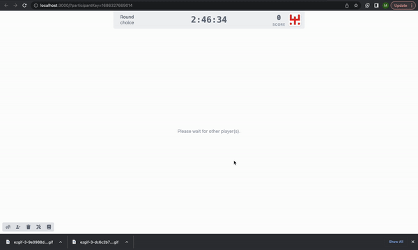

# Part 4.5: Build the "Result" React Component

Building out`Result.jsx` will be much like the `Choice.jsx`file, but will give us an opportunity to use the `.get()` method on empirica objects, and explore pulling data from all of the players in the game.

#### Develop the text display

As in the Result component, we'll start by replacing the return statement with what we hope to actually show. For now we'll use `XX`, `YY`, and `ZZ` as placeholders for the values we will insert later:

```jsx
return (
    <div>
      <p>You chose: XX</p>
      <p>Your partner chose: YY</p>
      <br />
      <p>You get ZZ months in jail!</p>
    </div>
  );
```

Our task now will be to collect the values for the player's choice, their opponent's choice, and the resulting score. Remember, these values were set based on the player's actions in the previous "Choice" stage.&#x20;

#### Report the player's choice

In the "Choice" stage, we saved the player's choice to the `player.round` object. Here we can use the associated `get` method to include it in our display. First we need to import the `usePlayer` hook at the top of our `client/src/stages/Result.jsx` file:

```jsx
import { usePlayer } from "@empirica/core/player/classic/react";
```

As before, we capture the `player` object at the top of the component function, before the return statement:

```jsx
const player = usePlayer();
```

Finally, we can update the display code to insert a value from the player.round object:

```jsx
<p>You chose: {player.round.get("decision")}</p>
```

> Note that `player.round.get(...)` needs to be enclosed in curly braces, to distinguish that we are inserting a piece of Javascript into the display syntax.

If you refresh the page, you should now see the player's choice displayed.

#### Report the partner's choice

We will now add a new hook to the file, `usePlayers`, which returns a list of all player objects in the game. Include it in the import statement above:

```jsx
import { usePlayer, usePlayers } from "@empirica/core/player/classic/react";
```

And as with `usePlayer`, set the result of the `usePlayers` hook to a constant at the top of the `Result` component function:

```jsx
const players = usePlayers();
```

We need to identify which player in this list is the "partner" to the current player. We do this by filtering the `players` list for all players with different `id` values to the current player. As this is a two-person game, that list will contain exactly one element, and so we can set the first element of the filtered list to be the player's partner. This code needs to live before the return statement, but after we have defined the `players` object.

```jsx
const partner = players.filter((p) => p.id !== player.id)[0];
```

> Note that here again we are using the inline "arrow" function syntax to define a function that will take each player in the list (shorthanded as `p`) and return true when `p` has a different id value than the current player. See here for more on the [filter](https://developer.mozilla.org/en-US/docs/Web/JavaScript/Reference/Global\_Objects/Array/filter) function.

Now that we have the partner object, we can display the value they set in the previous stage by replacing "YY" in our display with the appropriate `get` statement:

<pre class="language-jsx"><code class="lang-jsx"><strong>&#x3C;p>Your partner chose: {partner.round.get("decision")}&#x3C;/p>
</strong></code></pre>

At this point, you should be able to see both your own and your partner's responses in the browser window.

#### Display the result

Now we need to display the computed result. We will actually compute this result in the next section (Part 4.6) so for now we'll use code to display the value once it has been completed. In the next section we'll save the player's score to the `player.round` object, so here we'll use the following code to get that result:

```javascriptreact
<p>You get {player.round.get("score")} months in jail!</p>
```

Unfortunately, right now there is no value set for "score" on the current `player.round` object, and so the `get` function returns `undefined`. This means that the above code will just display "You get months in jail!".&#x20;

Instead, we'll use the "or" operator `||` to define a default value ("TBD") that will get inserted in the event that `player.round.get(...)` returns undefined:

```javascriptreact
<p>You get {player.round.get("score") || "TBD"} months in jail!</p>
```

#### Add a "continue" button

The last thing we want to do in this component is add a button to allow the player to continue on after they have read the result. Remember to import it at the top of the file:

```jsx
import { Button } from "../components/Button";
```

As we only have one button in this page, we can add it simply at the end of the return statement, within the outermost `<div>`.

```jsx
  <Button>
    Continue
  </Button>
```

We can build up our click handler inline, as it only needs to set the stage submission:

```jsx
<Button handleClick={() => player.stage.set("submit", true)}>
```

Your final code should look like this:


```jsx
import React from "react";
import { usePlayer, usePlayers } from "@empirica/core/player/classic/react";
import { Button } from "../components/Button";

export function Result() {
  const player = usePlayer();
  const players = usePlayers();
  const partner = players.filter((p) => p.id !== player.id)[0];

  return (
    <div>
      <p>You chose: {player.round.get("decision")}</p>
      <p>Your partner chose: {partner.round.get("decision")}</p>
      <br />
      <p>You get {player.round.get("score")} months in jail!</p>

      <Button handleClick={() => player.stage.set("submit", true)}>
        Continue
      </Button>
    </div>
  );
}
```


<figure><figcaption><p>participant sites at the end of this step</p></figcaption></figure>

If you step all the way through the experiment at this point, you will be directed to the exit survey, which asks some default demographic questions and your thoughts about the game. At this point the "synchronous" portion of the game is over, and participants have as much time as they need to complete the experiment.

We won't modify the exit survey in this tutorial, but if you would like to do so, it can be found under `client/src/intro-exit/ExitSurvey.jsx`.
